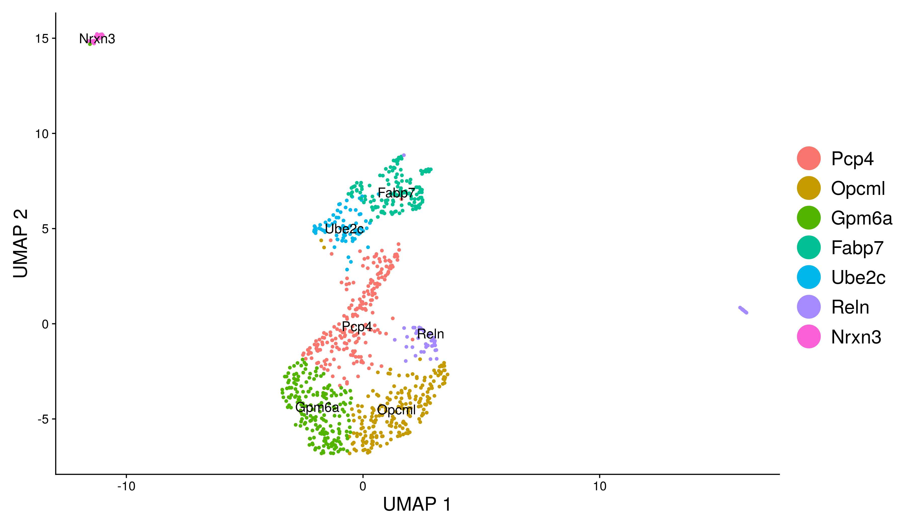
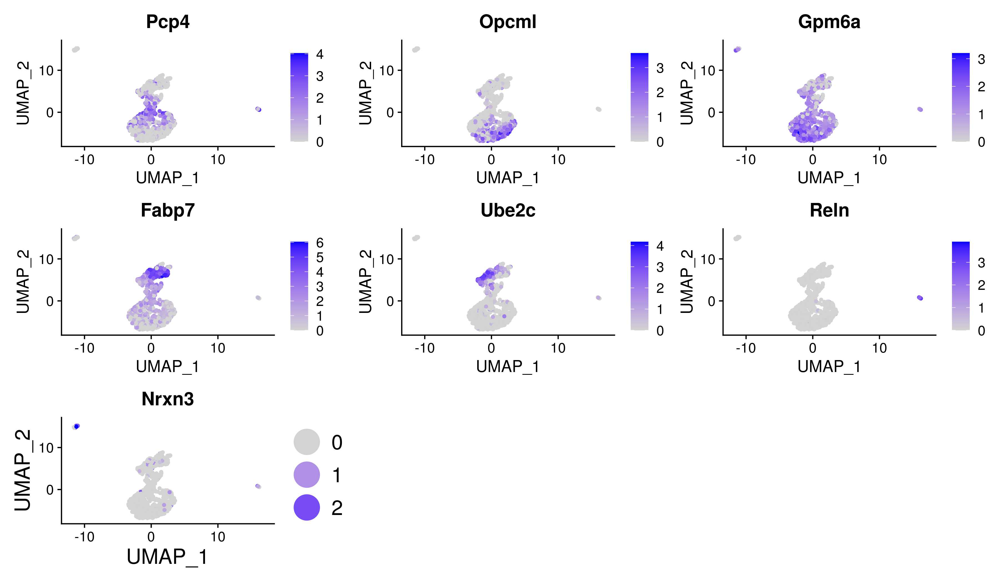

# Case Study - Replication of a Seurat workflow

Autoren: Guido Schlögel 00727019
         Sonja Tockner 00708717

## Abstract

While single cell RNA sequencing is an important tool in understanding biological systems, it still lacks standardization. To assess this we analyse the reproducibility of the Seurat package. We did this theoretically, replicated the tutorial and tested the workflow with different data. We concluded that replication is possible but some manual interventions are necessary that could lead to diverging results.

## Introduction

Replication of results is an important part of science. As it is important to avoid the replication crisis in data science, we want to show in this exercise how the Seurat tutorial for single cell RNA sequencing (scRNA-Seq) can be replicated and adapted to a different dataset.

scRNA-Seq is chosen as it became an important tool to understand biological systems, but still lacks standardization (Luecken and Theis 2019).

So what is it and why do we use it.

###  Advantages over bulk methods

In Single cell RNA-seq each sequencing library represents a single cell while Bulk RNA-Seq represents a whole cell population. Within a single tissue, there are many similar cells that may have specific functions, which can be addressed with scRNA Seq. Bulk sequencing studies the genome/transcriptome. The differential gene expression of healthy and diseased individuals is compared as an average representation, bulk RNA-seq is used for studying biomarkers and understanding the biology of diseases. scRNA Seq has several advantages over bulk RNA-seq, including more accurate prediction of disease, discovery of new cell types, and the ability to study gene expression in individual cells (e.g., finding differences in specific cell types).

scRNA Seq enables detailed analysis of individual cells and reveals cellular heterogeneity. In comparison, the bulk method measures the average expression across a population of cells and the cellular heterogeneity is masked. ScRNA Seq provides high resolution and transcriptional profiling of thousands of individual cells, allows to understand gene expression at a single cell level and finds differences within a heterogenous sample. It measures the distribution of the expression level for each gene across a population of cells. In comparison, a bulk sample represents many cells where all kinds of RNA sequences from the sample are extracted without filtering and enrichment, measuring the average expression level for each gene across a large population of input cells (e.g., a sample from the same tissue from different species).

### Basic steps of the scRNA-Seq analysis

The workflow for scRNA-Seq analysis basically consists of the preprocessing step of the raw data (quality control, normalization, data correction, feature selection and dimensions reduction) and the cell-and gene level downstream analysis of the count data.  
Biological tissue samples are used as input material. First, single-cell dissociation is performed, a suspension is generated, and the tissue is digested. This is followed by the isolation of the single cells. A distinction is made between plate-based and droplet-based methods. 

 In the next step, library construction is performed (breaking down the cell membrane), intracellular mRNA is captured, reverse-transcribed to cDNA molecules and amplified. The mRNA is then labeled with barcodes and possibly UMIs. Libraries are pooled for sequencing. Sequencing produces read data and is submitted to quality control.

We will deal with the data analysis steps of the Seurat workflow, they include:

* Preprocessing and Visualization
* Normalization
* Data correction and integration
* Feature selection, dimensions reduction and visualization
* Clustering and identification of clusters.

With this results different downstream steps are possible. 3 examples are:

* Differential gene expression analysis: This method comes from bulk gene expression analysis and examines the differential gene expression between two different conditions. DESeq2 and EdgeR are tools preferably used, weight estimation (introduce gene weights) can be included. It should be applied to measured data.

* Gene set analysis: Genes are grouped based on their involvement in common biological processes, e.g., use of paired gene labels to perform ligand-receptor analysis.

* Gene regulatory networks: Genes do not function independently. The expression level of a gene is determined by a complex interplay of regulatory interactions. Networks make it possible to discover the underlying regulatory interactions and to measure gene co-expression.

### Common problems

As mentioned above standardization of workflows is still lacking. Various software packages are available for different programming languages, Seurat is just one example. Deciding on one tool can make it difficult to compare data with other groups or change the platform at a later date. It is therefore necessary to make a selection with regards to the specific question.
 
 Some problems have already been addressed in the ScRNA Seq description, for example that cells form duplicates or that in some vials there are no cells at all. In general, many problems can already arise during sampling and preprocessing, which is why sample preparation and quality control are particularly important in all work steps in both applications, as they influence the entire further analysis.

### Challenges in integrating single-cell transcriptomic data across different conditions, technologies, and species

ScRNA Seq aims to represent a single condition, technology, or species and to discover cellular phenotypes. This enables the systematic reconstruction of cellular taxonomies in the human body. The biggest challenge is to identify subpopulations from multiple datasets. It is difficult to distinguish between changes in the composition of cell types in a sample and the expression changes within a given cell type when analyzing multiple datasets at the same time. Therefore, powerful new methods and a computational strategy are needed for learning between multiple datasets.

For example, zero-inflated differential expression tests have been tailored to scRNA-seq data to identify changes within a single cell type and clustering approaches detect proportional shifts across conditions if cell types are conserved. The methods should make it possible to learn between several data sets at the same time to facilitate a comparative analysis afterwards, e.g. with multivariant methods. Gene correlation patterns that are conserved across data sets can be identified and embed cells in a common low-dimensional space (e.g., through CCA). CCA enables information from several data sets to be displayed consistently (linear combination of features in data sets that are maximally correlated). Data sets are treated as multiple measurements of a gene-gene covariance structure, and one looks for patterns that are common to the data sets. Multi-Set CCA enables the integration of several data sets.

scRNA Seq data are generally noisier and more complex than bulk RNA Seq data and therefore computational more challenging. 

## Methods

We first analysed the existing workflow of the Seurat tutorial (Butler et al. 2018). We replicated the workflow and analysed it according to the "Ten Simple Rules for Reproducible Computational
Research" (Sandve et al. 2013)
### What problem does the workflow at hand address

The Seurat workflow analyses a dataset of Peripheral Blood Mononuclear Cells (PBMCs) from 10X Genomics and consists out of 2700 single cell data sequenced with Illumina's NextSeq 500.. Raw single-cell expression data are used as an input. Aim of the workflow is finding clusters in the data with a graph-based clustering method. It uses a combination of feature selection, dimensionality reduction and clustering algorithms to identify cell types. 
We use the Seurat workflow to robustly separate different cell types in the sample. The target is to integrate the whole workflow from data pre-processing to separation of cell types and the assignment of cell types to the clusters. It used highly variable features to get reliable results that can be compared between different samples.

### Setting up the required environment

In this step we want to recreate the environment used in the original notebook in an easy and reproducible way. While there are different options for this we decided to use anaconda (miniconda) for this task. We set up the conda forge channel as default and ran the following command:

`mamba create -n seurat r-base=4.1.0 r-ggplot2=3.3.5 patchwork=1.1.1 SeuratObject=4.0.2 Seurat=4.0.4 dplyr=1.0.7 r-knitr=1.33`

to create the environment. We kept the package versions used in the tutorial to avoid the risk of incompatibilities and tried to keep the environment as small as possible. The environment was exported as .yaml file to allow easy replication. This file is available on our GitHub page.
 
mamba is used instead of conda to speed up the environment management. This is especially relevant as we use the large conda forge channel. 

We noticed that is is advisable to set up conda forge as default channel. Failing to do so we got incompatibilities with outdated packages form the default repository.

It is also required to create the folder structure manually. The notebooks have to be in a subfolder (scripts in our case), the exact location of the data files has to be set in the notebook and an output folder must be present before running the code. While this could be automated with a bash skript, we believe the folder structure will be different for every project and therefore it is sensible to set it up manually.

### Explaination of the workflow

The workflow runs in the following basic steps:

#### Setting up the seurat object

Setting up the Seurat objects begins with reading in the data from the Cell ranger pipeline from 10 genomics. CellRanger is an analysis pipeline that processes single-cell data to align reads, generate feature barcode matrices, performs clustering and other secondary analysis. The output is an UMI (Unique Molecular Identifier) count matrix. The values in the matrix represent the number of molecules for each feature (gene, row) detected in each cell (column). The Count Matrix is used to create the Seurat object, which contains both the data and the analyses (e.g., PCA, clustering results), for a data set. 

#### Pre-processing

The preprocessing step is characterized by the selection and filtering of cells based on QC metrics, normalization of data and scaling or detection of highly variable features. QC metrics are defined by the user and are, for example: the number of unique genes in each cell (cells with poor quality or empty droplets often contain only a few genes, duplicates or multiplets can have very high gene counts). Unique genes correlate strongly with the number of molecules detected within a cell. Another metric is the percentage of reads that maps to the mitochondrial genome. Dying cells and cells with poor quality often have extensive mitochondrial contamination. After the filter steps, the data must be normalized. By default, the "LogNormalize" method is used for this, which normalizes the feature expression measurements for each cell by the total expression, multiplies by the scale factor (default 10000) and log-transforms the result.

#### Identification of highly variable features and PCA

Next we limit the further steps to the features showing a high variability. This ensures that we get less noise from the other features and makes the later calculation faster and more importantly leads to better results.
For the PCA the data from the variable features is normalized (mean = 0, variance = 1). Scaling is intended to achieve equal weighting in downstream analysis so that highly expressed genes do not dominate. After the PCA is performed the results are visualized. The loadings are presented, a scatter plot of the first PCs is created and heatmaps for the first PCs are created. This helps to identify where the relevant information can be found and which PCs and which loadings/genes are used later.

#### Determine 'dimensionality' of dataset

After the PCA we need to know how many dimensions are needed for the further analyses. In the Tutorial 2 heuristic methods are used. The first is the Jack Straw plot and the second the elbow plot. The elbow plot shows a ranking of PCs based on the percentage of variance explained (cutoff between PC 7 -12)

#### Cluster the cells

For clustering the cells Seurat uses a graph-based clustering approach. The distance metric remains the same and is based on the previously identified PCs. The approach is based on manuscripts applied to graph-based clustering approaches with scRNA seq data and is characterized by a graph structure, e.g., KNN nearest neighbors. As we do not know a priory how many clusters/cell type we will find this is a sensible approach. The clusters are displayed using the UMAP non linear dimension reduction.

#### Finding differentially expressed features

Then, biomarkers must be found which define clusters through differential gene expression. Additionally the genes with the highest fold change for each cluster are calculated. With additional information about the cell types expected in the sample the clusters can be assigned to cell types. By default, positive and negative markers of a single cluster are identified compared to all other cells. Therefore, a threshold value must be set: A trait must be recognized to a minimum percentage in one of the two cell groups and must be expressed differently between the two groups.

#### Visualization of the marker expression/results

The violin plot shows the expression probability distribution over the clusters. The feature plot visualizes the feature expression. As the last step in the workflow, canonical markers are sent to assign the unbiased clustering to known cell types (9 assignments: "Naive CD4 T", "CD14 + Mono", "Memory CD4 T", "B", "CD8 T", " FCGR3A + Mono ", "NK", "DC", "Platelet"). The new clusters are visualized as an umap.

## Results

### Is a replication of the tutorial

Generally a replication of the tutorial is possible. We compare the tutorial with the 10 rules/recommendations from Sandve et al. 2013:

#### Rule 1: For Every Result, Keep Track of How It Was Produced

The Tutorial is available as R-notebook and vignette. So all Steps and R commands are available.

#### Rule 2: Avoid Manual Data Manipulation Steps

 The data are not manually manipulated, but there are a couple of manual interventions in the script, for example the cut off in the pre-processing, the number of PCs used for further analysis and the feature selection for the cell type assignment. Without concrete rules for these decisions reproducible results are difficult to obtain.

### Rule 3. Archive the Exact Versions of All External Programs Used

This is done with the `sessionInfo()` command. The version of R and the used packages is available.

#### Rule 4: Version Control All Custom Scripts

The Seurat package has its own GitHub repository. Past versions of the Tutorial are available.

#### Rule 5: Record All Intermediate Results, When Possible in Standardized Formats

The created Seurat Object is saved as an .rds file. As this is standard in R and further analysis will be done with R as well, this is a good choice.

#### Rule 6 For Analyses That Include Randomness, Note Underlying Random Seeds

The way the Seurat packages deal with randomness, was confusing for us. The seed is not set in the notebook, but hidden in the Seurat package. This leds to the strange situation that for example the Jack Straw Plot differs visibly, if not significantly, from the tutorial, but there is no random change when run again as expected. The difference is due to the different handling of seed values on different operating systems. For us it had been nicer to set the seed in the final notebook to avoid confusion.

#### Rule 7: Always Store Raw Data behind Plots

Most of the plots just require the Seurat object, which is covered in Rule 5. It would be nice to store additional data, like used features and cluster labels' in an easier to read form. In the current form they are in the code. So everything is reproducible, but not always easy to find.

#### Rule 8 Generate Hierarchical Analysis Output, Allowing Layers of Increasing Detail to Be Inspected

The Tutorial is more a way to show the capabilities of the package than a good way to represent results. Therefore rule is not applied.

#### Rule 9: Connect Textual Statements to Underlying Results

Similar to rule 8 this is missing as a thorough explanation of the results is not part of the tutorial.

#### Rule 10: Provide Public Access to Scripts, Runs, and Results

The code is available in the GitHub repository.

### Analysis on own dataset

A new dataset was introduced to test the possibility to reuse the code.

The dataset we used is from 10X Genomics. 
https://www.10xgenomics.com/resources/datasets/1-k-brain-cells-from-an-e-18-mouse-2-standard-2-1-0

Description:
Cells from a combined cortex, hippocampus and sub ventricular zone of an E18 mouse.
* 931 cells detected
* Sequenced on Illumina HiSeq2500 with approximately 56,000 reads per cell
* 26bp read1 (16bp Chromium barcode and 10bp UMI), 98bp read2 (transcript), and 8bp I7 sample barcode

### Challenges of the new dataset

One challenge was certainly to define the features/markers for the final analysis. In the original tutorial, this point was not explicitly described or the markers were already predefined in the code. When using the new dataset, it was of course necessary to deal with it more intensively. For this purpose it was necessary to look at the code in more detail in order to be able to make a meaningful selection.

### Required modifications

* First the path had to be changed to the folder with the new dataset
* In the new dataset the mitochondrial genes start with "mt-". The lower case is not recognized by the original pattern. The code was adapted to find the desired genes in the    new dataset
* The new dataset has a higher number of features per read. Therefore the filter was redefined according to the plots 
* The name of the saved Seurat object is changed to separate the different datasets
* Assigning marker genes to the clusters: In this step we do not have enough background information to link our marker genes with cell types. Therefore we mark the clusters with the best marker gene.

### Comparison to original dataset

The replication of the tutorial with the new dataset yielded results with the new dataset which unfortunately were not quite as nice as in the original workflow. Only PC 1 showed a good separation in the new dataset, which made the plots more difficult to interpret and the results not quite as impressive. 

### Results of the new dataset

As mentioned above we were able to use the workflow for our new dataset. We were able to find 7 different clusters and annotated them with the gene highest fold change.

We observed that 1 marker gene in not enough to identify the cluster. To do this we need more information about the dataset.

We see that the genes are present in the corresponding clusters, but there are limitations. For example the Rein gene is only present in part of the cluster associated with it. It could also be necessary to fine tune the settings to get a different number of clusters better suited to the sample.

## Discussion

We want to note, that we we focused on the workflow and not on the data interpretation. To get more information we should combine our results with biological information about the sample.

It is possible to reproduce the tutorial and use the method on a different dataset. While it worked well there are some options to make it easier. First the form of a notebook makes it difficult to see where parameters are set and manual interventions are necessary. It is hard to make changes without checking the whole code. In our opinion it would be easier to write the code in functions or methods and use all variables as function parameters. Notebooks are suited for presentation but are limited for simply reusable code.

It would be possible to do the analysis in 2 well defined steps. Step 1 starting from pre-processing and ending with the analysis of the PCs. At this point manual intervention is done. The rest of the analyses can be performed without manual intervention in a second function or method.

### Literature

Luecken and Theis 2019. Current best practices in single-cell RNA-seq analysis: a tutorial. Molecular
Systems Biology. 15(6):e8746. doi:10.15252/msb.20188746.

Butler et al. 2018. Integrating single-cell transcriptomic data across different conditions, technologies,
and species. Nat Biotechnol. 36(5):411–420. doi:10.1038/nbt.4096.

Sandve et al. 2013. Ten Simple Rules for Reproducible Computational Research. PLOS Computational
Biology. 9(10):e1003285. doi:10.1371/journal.pcbi.1003285.
