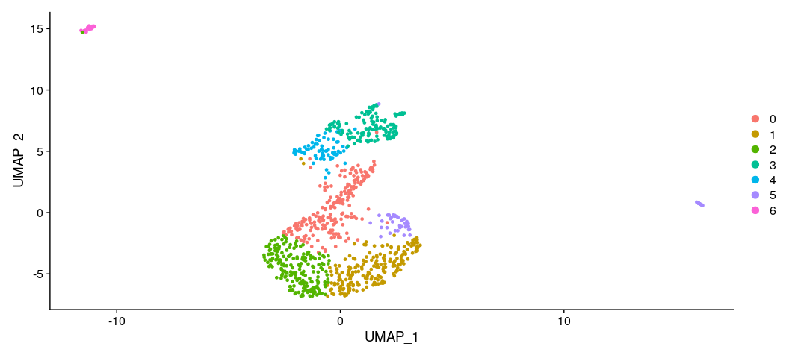

Adaption of workflow to new dataset
================
Guido Schlögel, Sonja Tockner
Compiled: December 01, 2021

In this document only the differences to the original workflow are
described. A more detailed description of the workflow is found in the
original tutorial description. The code can be found
[here](https://github.com/gschloegel/Course_Fallstudie_scRNA-Seq-with-Seurat/blob/main/scripts/new_dataset_neurons_900.rmd)

## Preperation

The workflow of the Seurat tutorial is adapted to the new dataset:

[1k Brain Cells from an E18
Mouse](https://www.10xgenomics.com/resources/datasets/1-k-brain-cells-from-an-e-18-mouse-2-standard-2-1-0)

  - Cells from a combined cortex, hippocampus and sub ventricular zone
    of an E18 mouse
  - Sequenced on Illumina HiSeq2500 with approximately 56,000 reads per
    cell
  - 26bp read1 (16bp Chromium barcode and 10bp UMI), 98bp read2
    (transcript), and 8bp I7 sample barcode

The filtered data set is unpacked into the data folder of the project.

## Loading libraries

``` r
library(dplyr)
library(Seurat)
library(patchwork)
```

## Setup the seurat Object

The path has to be changed to the folder with the new data.

``` r
# Load the PBMC dataset
pbmc.data <- Read10X(data.dir = "../data/neurons_900_filtered_gene_bc_matrices/filtered_gene_bc_matrices/mm10/")
# Initialize the Seurat object with the raw (non-normalized data).
pbmc <- CreateSeuratObject(counts = pbmc.data, project = "neurons_900", min.cells = 3, min.features = 200)
pbmc
```

    ## An object of class Seurat 
    ## 14144 features across 917 samples within 1 assay 
    ## Active assay: RNA (14144 features, 0 variable features)

## Preprocessing and Quality control

In the new dataset the mitochondrial genes start with “mt-”. The lower
case is not recognized by the original pattern. The code was adapted to
find the desired genes in the new dataset.

``` r
# The [[ operator can add columns to object metadata. This is a great place to stash QC stats
pbmc[["percent.mt"]] <- PercentageFeatureSet(pbmc, pattern = "^MT-|^mt-") # changing pattern
```

## Visualization of QC Metrices

``` r
# Visualize QC metrics as a violin plot
VlnPlot(pbmc, features = c("nFeature_RNA", "nCount_RNA", "percent.mt"), ncol = 3)
```

<!-- -->

## Visualization of feature-feature relationships by FeatureScatter

``` r
# FeatureScatter is typically used to visualize feature-feature relationships, but can be used
# for anything calculated by the object, i.e. columns in object metadata, PC scores etc.

plot1 <- FeatureScatter(pbmc, feature1 = "nCount_RNA", feature2 = "percent.mt")
plot2 <- FeatureScatter(pbmc, feature1 = "nCount_RNA", feature2 = "nFeature_RNA")
plot1 + plot2
```

<!-- -->

## Subsets with specific filter criteria can also be defined

The new dataset has a higher number of features. Therefore the filter
was redefined according to the plots above.

``` r
pbmc <- subset(pbmc, subset = nFeature_RNA > 1000 & nFeature_RNA < 7000 & percent.mt < 10) # adapted values according to the plots
```

## Normalization of the data

The normalization is performed using the standard parameters.

``` r
pbmc <- NormalizeData(pbmc)
```

## Feature selection for the identification of highly variable features

The number of selected features remains unchanged for the new data

``` r
pbmc <- FindVariableFeatures(pbmc, selection.method = "vst", nfeatures = 2000)

# Identify the 10 most highly variable genes
top10 <- head(VariableFeatures(pbmc), 10)

# plot variable features with and without labels
plot1 <- VariableFeaturePlot(pbmc)
plot2 <- LabelPoints(plot = plot1, points = top10, repel = TRUE)
plot1 + plot2
```

<!-- -->

## Scaling of the data

We use the standard options here as we just need the selected features
afterwards. There is no need to scale the not-selected features.

``` r
pbmc <- ScaleData(pbmc)
```

## Linear dimension reduction

``` r
pbmc <- RunPCA(pbmc, features = VariableFeatures(object = pbmc))
```

## Visualizing cells and features that define PCA

``` r
# Examine and visualize PCA results in a few different ways
print(pbmc[["pca"]], dims = 1:5, nfeatures = 5)
```

    ## PC_ 1 
    ## Positive:  Dbi, Phgdh, Hmgb2, Ddah1, Fabp7 
    ## Negative:  Tubb3, Tmsb10, Stmn3, Neurod2, Sox11 
    ## PC_ 2 
    ## Positive:  Pantr1, Ran, Hmgb1, Meis2, Hmgn2 
    ## Negative:  Igfbp7, Col4a2, Gng11, Bgn, Emcn 
    ## PC_ 3 
    ## Positive:  Aldoc, Ndrg2, Mt3, Mt1, Mt2 
    ## Negative:  Top2a, Spc25, Birc5, Cdca2, Kif22 
    ## PC_ 4 
    ## Positive:  Rpl18a, Eomes, Mfap4, Mfng, Sstr2 
    ## Negative:  Ly6h, Tubb2a, Islr2, Stmn2, Gap43 
    ## PC_ 5 
    ## Positive:  Ptprz1, Pantr1, Dab1, Meis2, Clmp 
    ## Negative:  Reln, Trp73, Nhlh2, Cacna2d2, Lhx5

``` r
VizDimLoadings(pbmc, dims = 1:2, reduction = "pca")
```

<!-- -->

``` r
DimPlot(pbmc, reduction = "pca")
```

<!-- -->

We observe that PC1 is evenly distributed while PC2 is influenced by a
low number of values. \#\# Visualization with DimHeatmap(). As in the
original Tutorial we use the heat maps to select the PCs containing the
most relevant information for our dataset. We observe that the
separation is not optimal and that PC1 has the biggest impact.

``` r
DimHeatmap(pbmc, dims = 1, cells = 500, balanced = TRUE)
```

<!-- -->

``` r
DimHeatmap(pbmc, dims = 1:15, cells = 500, balanced = TRUE)
```

<!-- -->
\#\# Determine the dimensionality of a dataset We use the JackStraw plot
as well as the EllbowPlot the determine the number of PCs used for
further analysis. \#\#\# Jack Straw Plot

``` r
# NOTE: This process can take a long time for big datasets, comment out for expediency. More
# approximate techniques such as those implemented in ElbowPlot() can be used to reduce
# computation time
pbmc <- JackStraw(pbmc, num.replicate = 100)
pbmc <- ScoreJackStraw(pbmc, dims = 1:20)
```

Comparison of the distribution of p-values for each PC with a unit
distribution. Significant PCs show a strong enrichment of features with
low p-values (solid curve above the dashed line).

``` r
JackStrawPlot(pbmc, dims = 1:20)
```

<!-- -->
\#\#\# Elbow plot

``` r
ElbowPlot(pbmc, ndims = 30)
```

<!-- -->
\#\#\# Select PCs
The Jack Straw Plot is not conclusive. The ellbow plot
suggests that 15 PCs could be a good choice. We will later try different
amount of PCs to check if the results are robust to these changes.

``` r
used_dims = 15
```

## Cluster the cells

We use the standard graph based clustering approach as we do not know
how many cluster we can expect.

``` r
pbmc <- FindNeighbors(pbmc, dims = 1:used_dims)
pbmc <- FindClusters(pbmc, resolution = 0.5)
```

    ## Modularity Optimizer version 1.3.0 by Ludo Waltman and Nees Jan van Eck
    ## 
    ## Number of nodes: 898
    ## Number of edges: 26689
    ## 
    ## Running Louvain algorithm...
    ## Maximum modularity in 10 random starts: 0.8048
    ## Number of communities: 7
    ## Elapsed time: 0 seconds

``` r
# Look at cluster IDs of the first 5 cells
head(Idents(pbmc), 5)
```

    ## AAACCTGGTCTCGTTC-1 AAACGGGAGCCACGTC-1 AAACGGGAGCGAGAAA-1 AAACGGGCACACCGAC-1 
    ##                  1                  0                  0                  4 
    ## AAACGGGTCGCCAGCA-1 
    ##                  1 
    ## Levels: 0 1 2 3 4 5 6

## Non-linear dimensional reduction(UMAP)

We use UMAP to visualize the clusters.

``` r
pbmc <- RunUMAP(pbmc, dims = 1:used_dims)
```

``` r
# note that you can set `label = TRUE` or use the LabelClusters function to help label
# individual clusters
DimPlot(pbmc, reduction = "umap")
```

<!-- -->
The name of the saved Seurat object is changed to seperate the different
datasets.

``` r
### output ordner angelegt
saveRDS(pbmc, file = "../output/pbmc_neurons_900.rds")
```

## Search for differentially expressed traits (cluster biomarkers)

We search for the 2 genes with the highest fold change for each cluster.
Later we use them to mark the clusters.

``` r
# find markers for every cluster compared to all remaining cells, report only the positive
# ones
pbmc.markers <- FindAllMarkers(pbmc, only.pos = TRUE, min.pct = 0.25, logfc.threshold = 0.25)
biomarkers <- pbmc.markers %>%
    group_by(cluster) %>%
    slice_max(n = 2, order_by = avg_log2FC)
print(biomarkers)
```

    ## # A tibble: 14 × 7
    ## # Groups:   cluster [7]
    ##       p_val avg_log2FC pct.1 pct.2 p_val_adj cluster gene  
    ##       <dbl>      <dbl> <dbl> <dbl>     <dbl> <fct>   <chr> 
    ##  1 1.40e-34       1.57 0.692 0.294  1.99e-30 0       Pcp4  
    ##  2 2.05e-29       1.43 0.562 0.206  2.90e-25 0       Eomes 
    ##  3 4.50e-77       2.17 0.85  0.242  6.36e-73 1       Opcml 
    ##  4 3.32e-59       1.75 0.662 0.145  4.70e-55 1       Snca  
    ##  5 1.98e-50       1.21 0.974 0.741  2.80e-46 2       Gpm6a 
    ##  6 9.41e-46       1.21 0.907 0.521  1.33e-41 2       Myt1l 
    ##  7 7.28e-54       4.31 0.934 0.647  1.03e-49 3       Fabp7 
    ##  8 4.08e-80       3.52 0.934 0.299  5.77e-76 3       Mt3   
    ##  9 3.23e-45       2.69 0.84  0.179  4.57e-41 4       Ube2c 
    ## 10 6.31e-40       2.60 1     0.554  8.92e-36 4       Hmgb2 
    ## 11 1.49e-31       2.79 0.34  0.021  2.11e-27 5       Reln  
    ## 12 3.68e-25       2.28 0.321 0.026  5.20e-21 5       Snhg11
    ## 13 2.44e-71       2.80 0.92  0.044  3.46e-67 6       Nrxn3 
    ## 14 5.54e-14       2.54 0.84  0.321  7.83e-10 6       Mef2c

## Visualization of the marker expression

We use the VinPlot to show the distribution of the genes with the
highest positive and negative loadings of PC1. We see the different
expressions in the different clusters and can, for example, see that
Phgdh is almost exlusivly expressted in the clusters 3 and 4.

``` r
VlnPlot(pbmc, features = c("Dbi", "Phgdh"))
```

<!-- -->

``` r
# you can plot raw counts as well
VlnPlot(pbmc, features = c("Tubb3", "Tmsb10"), slot = "counts", log = TRUE)
```

<!-- -->
Nest we check our marker genes for the different clusters. We slice the
biomarkers data frame to just view the genes with the highest fold
change.

``` r
FeaturePlot(pbmc, features = biomarkers$gene[c(TRUE, FALSE)])
```

<!-- -->

DoHeatmap can be used to generate an expression heatmap for cells and
features. The top 20 markers for each cluster are plotted here.

``` r
pbmc.markers %>%
    group_by(cluster) %>%
    top_n(n = 10, wt = avg_log2FC) -> top10
DoHeatmap(pbmc, features = top10$gene) + NoLegend()
```

<!-- -->

## Assigning marker genes to the clusters

In this step we do not have enough background information to link our
marker genes with cell types. Therefore we mark the clusters with the
best marker gene.

``` r
new.cluster.ids <- biomarkers$gene[c(TRUE, FALSE)]
names(new.cluster.ids) <- levels(pbmc)
pbmc <- RenameIdents(pbmc, new.cluster.ids)
DimPlot(pbmc, reduction = "umap", label = TRUE, pt.size = 0.5) + NoLegend()
```

<!-- -->

``` r
saveRDS(pbmc, file = "../output/neurons_900_final.rds")
```

<details>

<summary>**Session Info**</summary>

``` r
sessionInfo()
```

    ## R version 4.1.0 (2021-05-18)
    ## Platform: x86_64-conda-linux-gnu (64-bit)
    ## Running under: Fedora 34 (Workstation Edition)
    ## 
    ## Matrix products: default
    ## BLAS/LAPACK: /home/gschloegel/miniconda3/envs/seurat2/lib/libopenblasp-r0.3.18.so
    ## 
    ## locale:
    ##  [1] LC_CTYPE=en_US.UTF-8       LC_NUMERIC=C              
    ##  [3] LC_TIME=en_US.UTF-8        LC_COLLATE=en_US.UTF-8    
    ##  [5] LC_MONETARY=en_US.UTF-8    LC_MESSAGES=en_US.UTF-8   
    ##  [7] LC_PAPER=en_US.UTF-8       LC_NAME=C                 
    ##  [9] LC_ADDRESS=C               LC_TELEPHONE=C            
    ## [11] LC_MEASUREMENT=en_US.UTF-8 LC_IDENTIFICATION=C       
    ## 
    ## attached base packages:
    ## [1] stats     graphics  grDevices utils     datasets  methods   base     
    ## 
    ## other attached packages:
    ## [1] ggplot2_3.3.5      patchwork_1.1.1    SeuratObject_4.0.2 Seurat_4.0.4      
    ## [5] dplyr_1.0.7       
    ## 
    ## loaded via a namespace (and not attached):
    ##   [1] nlme_3.1-153          spatstat.sparse_2.0-0 matrixStats_0.61.0   
    ##   [4] RcppAnnoy_0.0.19      RColorBrewer_1.1-2    httr_1.4.2           
    ##   [7] sctransform_0.3.2     tools_4.1.0           utf8_1.2.2           
    ##  [10] R6_2.5.1              irlba_2.3.3           rpart_4.1-15         
    ##  [13] KernSmooth_2.23-20    uwot_0.1.10           mgcv_1.8-38          
    ##  [16] lazyeval_0.2.2        colorspace_2.0-2      withr_2.4.2          
    ##  [19] tidyselect_1.1.1      gridExtra_2.3         compiler_4.1.0       
    ##  [22] cli_3.1.0             plotly_4.10.0         labeling_0.4.2       
    ##  [25] scales_1.1.1          lmtest_0.9-39         spatstat.data_2.1-0  
    ##  [28] ggridges_0.5.3        pbapply_1.5-0         goftest_1.2-3        
    ##  [31] stringr_1.4.0         digest_0.6.28         spatstat.utils_2.2-0 
    ##  [34] rmarkdown_2.11        pkgconfig_2.0.3       htmltools_0.5.2      
    ##  [37] parallelly_1.29.0     highr_0.9             fastmap_1.1.0        
    ##  [40] htmlwidgets_1.5.4     rlang_0.4.12          rstudioapi_0.13      
    ##  [43] shiny_1.7.1           farver_2.1.0          generics_0.1.1       
    ##  [46] zoo_1.8-9             jsonlite_1.7.2        ica_1.0-2            
    ##  [49] magrittr_2.0.1        Matrix_1.3-4          Rcpp_1.0.7           
    ##  [52] munsell_0.5.0         fansi_0.4.2           abind_1.4-5          
    ##  [55] reticulate_1.22       lifecycle_1.0.1       stringi_1.7.5        
    ##  [58] yaml_2.2.1            MASS_7.3-54           Rtsne_0.15           
    ##  [61] plyr_1.8.6            grid_4.1.0            parallel_4.1.0       
    ##  [64] listenv_0.8.0         promises_1.2.0.1      ggrepel_0.9.1        
    ##  [67] crayon_1.4.2          deldir_1.0-6          miniUI_0.1.1.1       
    ##  [70] lattice_0.20-45       cowplot_1.1.1         splines_4.1.0        
    ##  [73] tensor_1.5            knitr_1.33            pillar_1.6.4         
    ##  [76] igraph_1.2.9          spatstat.geom_2.3-0   future.apply_1.8.1   
    ##  [79] reshape2_1.4.4        codetools_0.2-18      leiden_0.3.9         
    ##  [82] glue_1.5.0            evaluate_0.14         data.table_1.14.2    
    ##  [85] png_0.1-7             vctrs_0.3.8           httpuv_1.6.3         
    ##  [88] polyclip_1.10-0       gtable_0.3.0          RANN_2.6.1           
    ##  [91] purrr_0.3.4           spatstat.core_2.3-2   tidyr_1.1.4          
    ##  [94] scattermore_0.7       future_1.23.0         xfun_0.28            
    ##  [97] mime_0.12             xtable_1.8-4          RSpectra_0.16-0      
    ## [100] later_1.2.0           survival_3.2-13       viridisLite_0.4.0    
    ## [103] tibble_3.1.6          cluster_2.1.2         globals_0.14.0       
    ## [106] fitdistrplus_1.1-6    ellipsis_0.3.2        ROCR_1.0-11

</details>
