Replication and Description of Seurat Tutorial
================
Guido Schlögel, Sonja Tockner
Compiled: December 01, 2021

### Task specification: Case study

In the following code replicates the [seurat
tutorial](https://satijalab.org/seurat/articles/pbmc3k_tutorial.html).
The code for this notebook can be found
[here](https://github.com/gschloegel/Course_Fallstudie_scRNA-Seq-with-Seurat/blob/main/scripts/replicated_tutorial_pbmc3k.rmd)

A dataset of Peripheral Blood Mononuclear Cells(PBMC) is analyzed. The
dataset is from 10X Genomics and consists out of 2700 single cells
sequenced with Illumina’s NextSeq 500.

### Loading libraries

``` r
library(dplyr)
library(Seurat)
library(patchwork)
library(ggplot2)
```

## Setup the seurat Object

Reading in the data: The Read10X() function is used to read the output
of the Cellranger pipeline from 10X. Cellranger is an analysis pipeline
that processes single-cell data to align reads, generates feature
barcode matrices, performs clustering and other secondary analysis. The
output is an UMI(Unique Molecular Identifier) count martix. UMIs are
short sequences that are added to DNA sequences to uniquely identify the
DNA molecule. The values in the matrix represent the number of molecules
for each feature (gene, row) detected in each cell (column). The Count
Matrix is used to create the Seurat object, which contains both the data
and the analysis, e.g. PCA, clustering results, for a data set.

``` r
# Load the PBMC dataset
pbmc.data <- Read10X(data.dir = "../data/pbmc3k/filtered_gene_bc_matrices/hg19/")
# Initialize the Seurat object with the raw (non-normalized data).
pbmc <- CreateSeuratObject(counts = pbmc.data, project = "pbmc3k", min.cells = 3, min.features = 200)
pbmc
```

    ## An object of class Seurat 
    ## 13714 features across 2700 samples within 1 assay 
    ## Active assay: RNA (13714 features, 0 variable features)

## Preprocessing and Quality control

Preprocessing means the selection and filtering of cells based on QC
metrices, normalization of the data and scaling or the detection of
highly variable features. QC metrices are defined by the user and are,
for example: the number of unique genes in each cell (cells with poor
quality or empty droplets often contain only a few genes, duplicates or
multiplets can have very high gene counts). Unique genes correlate
strongly with the number of molecules that are detected within a cell.
Another metric is the percentage of reads that map to the mitochondrial
genome. Dying and poor quality cells often have extensive mitochondrial
contamination. The calculation is done with PercentageFeatureSet (), a
function that calculates the percentage of counts from a certain feature
set. (all genes starting with MT).

``` r
# The [[ operator can add columns to object metadata. This is a great place to stash QC stats
pbmc[["percent.mt"]] <- PercentageFeatureSet(pbmc, pattern = "^MT-")
```

## Visualization of QC Metrices

The filter criteria for the cells are defined as follows: Unique feature
count \> 2500 or \< 200 and mitochondrial counts \> 5%.

``` r
# Visualize QC metrics as a violin plot
VlnPlot(pbmc, features = c("nFeature_RNA", "nCount_RNA", "percent.mt"), ncol = 3)
```

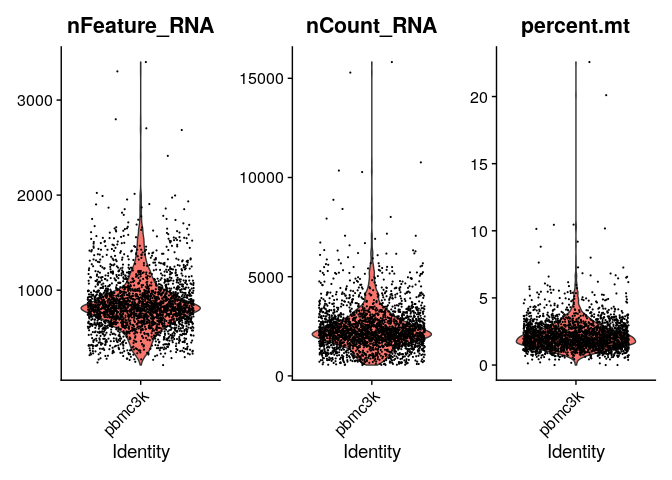<!-- -->

## Visualization of feature-feature relationships by FeatureScatter

``` r
# FeatureScatter is typically used to visualize feature-feature relationships, but can be used
# for anything calculated by the object, i.e. columns in object metadata, PC scores etc.

plot1 <- FeatureScatter(pbmc, feature1 = "nCount_RNA", feature2 = "percent.mt")
plot2 <- FeatureScatter(pbmc, feature1 = "nCount_RNA", feature2 = "nFeature_RNA")
plot1 + plot2
```

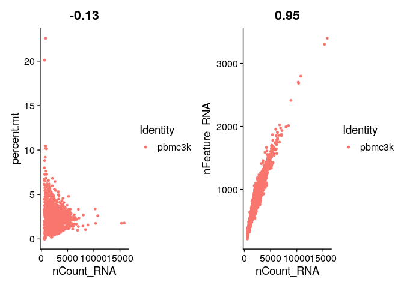<!-- -->

## Subsets with specific filter criteria can also be defined

``` r
pbmc <- subset(pbmc, subset = nFeature_RNA > 200 & nFeature_RNA < 2500 & percent.mt < 5)
```

## Normalization of the data

After the filter steps, the data must be normalized. By default, the
“LogNormalize” method is used for this, which normalizes the feature
expression measurements for each cell by the total expression,
multiplies by the scale factor (default 10000) and log-transforms the
result.

``` r
pbmc <- NormalizeData(pbmc, normalization.method = "LogNormalize", scale.factor = 10000)
```

``` r
### the same
pbmc <- NormalizeData(pbmc)
```

## Feature selection for the identification of highly variable features

A subset of features is defined with high cell-to-cell variation in the
expression (highly expressed in some cells and lowly expressed in
others); the further focus of the analysis is then placed on these
genes. Therefore the FindVariablesFeatures () function is used which
allows directy modeling of the mean-variance relationship in single-cell
data. Default: 2000 features per dataset, used e.g. for PCA

``` r
pbmc <- FindVariableFeatures(pbmc, selection.method = "vst", nfeatures = 2000)

# Identify the 10 most highly variable genes
top10 <- head(VariableFeatures(pbmc), 10)

# plot variable features with and without labels
plot1 <- VariableFeaturePlot(pbmc)
plot2 <- LabelPoints(plot = plot1, points = top10, repel = TRUE)
plot1 + plot2
```

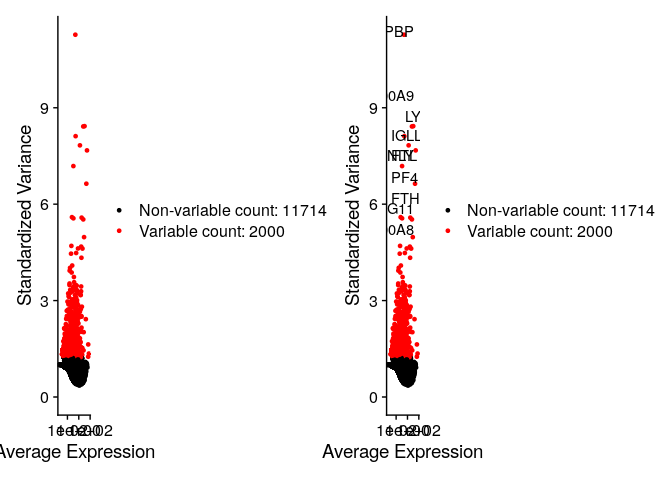<!-- -->

## Scaling of the data

Scaling is the linear transformation which is the standard before
dimension reduction techniques like PCA. (mean expression across cells
is 0 and variance across cells is 1). Scaling is intended to achieve
equal weighting in downstream analysis so that highly expressed genes do
not dominate.

``` r
all.genes <- rownames(pbmc)
pbmc <- ScaleData(pbmc, features = all.genes)
```

## Linear dimension reduction

The next step is to perform PCA on the scaled data. By default, the
previously defined features are used, but a new subset can also be
defined.

``` r
pbmc <- RunPCA(pbmc, features = VariableFeatures(object = pbmc))
```

## Visualizing cells and features that define PCA

``` r
# Examine and visualize PCA results a few different ways
print(pbmc[["pca"]], dims = 1:5, nfeatures = 5)
```

    ## PC_ 1 
    ## Positive:  CST3, TYROBP, LST1, AIF1, FTL 
    ## Negative:  MALAT1, LTB, IL32, IL7R, CD2 
    ## PC_ 2 
    ## Positive:  CD79A, MS4A1, TCL1A, HLA-DQA1, HLA-DQB1 
    ## Negative:  NKG7, PRF1, CST7, GZMB, GZMA 
    ## PC_ 3 
    ## Positive:  HLA-DQA1, CD79A, CD79B, HLA-DQB1, HLA-DPB1 
    ## Negative:  PPBP, PF4, SDPR, SPARC, GNG11 
    ## PC_ 4 
    ## Positive:  HLA-DQA1, CD79B, CD79A, MS4A1, HLA-DQB1 
    ## Negative:  VIM, IL7R, S100A6, IL32, S100A8 
    ## PC_ 5 
    ## Positive:  GZMB, NKG7, S100A8, FGFBP2, GNLY 
    ## Negative:  LTB, IL7R, CKB, VIM, MS4A7

``` r
VizDimLoadings(pbmc, dims = 1:2, reduction = "pca")
```

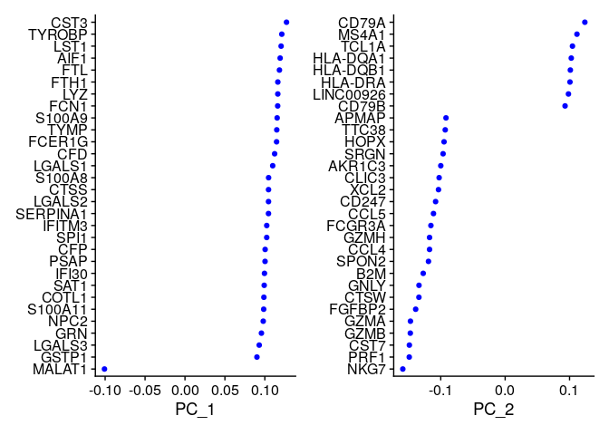<!-- -->

``` r
DimPlot(pbmc, reduction = "pca")
```

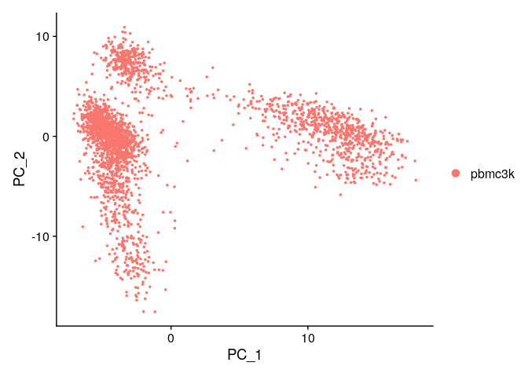<!-- -->

## Visualization with DimHeatmap()

DimHeatmap() allows visualization of the primary source of heterogeneity
in the dataset and can help to decide which PCs to use for further
downstream analysis. Cells and features are ordered by their PCA scores,
which also increases speed. This is especially important for large
datasets.

``` r
DimHeatmap(pbmc, dims = 1, cells = 500, balanced = TRUE)
```

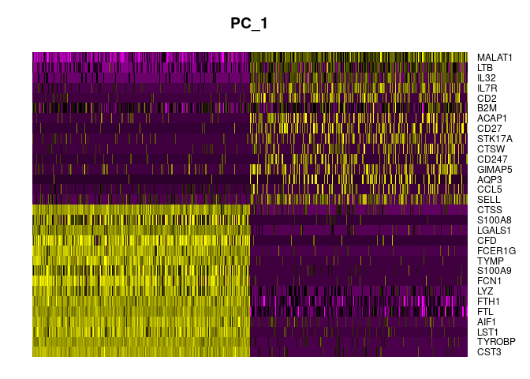<!-- -->

``` r
DimHeatmap(pbmc, dims = 1:15, cells = 500, balanced = TRUE)
```

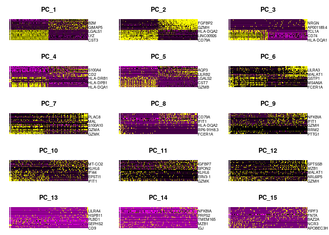<!-- -->

## Determine the dimensionality of a dataset

To eliminate technical noise in the individual features, Seurat clusters
the cells based on their PCA scores, each PC representing a so-called
“metafeature” which combines information about a correlated feature
set. In a resampling test, a subset of the data (1% by default) is
randomly selected and the PCA is repeated. A null distribution of
feature scores is identified…the procedure is repeated…This allows one
to identify significant PCs that contain many low p-values.

``` r
# NOTE: This process can take a long time for big datasets, comment out for expediency. More
# approximate techniques such as those implemented in ElbowPlot() can be used to reduce
# computation time
pbmc <- JackStraw(pbmc, num.replicate = 100)
pbmc <- ScoreJackStraw(pbmc, dims = 1:20)
```

## Visualization

Comparison of the distribution of p-values for each PC with a unit
distribution. Significant PCs show a strong enrichment of features with
low p-values (solid curve above the dashed line), we can see a sharp
drop-off in significance after the first 10 - 12 PCs.

``` r
JackStrawPlot(pbmc, dims = 1:15)
```

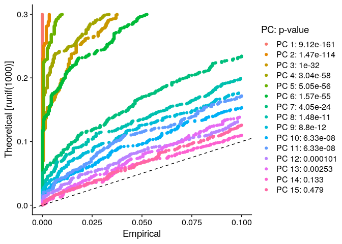<!-- -->

## Alternative: Elbow plot

This plot shows a ranking of PCs based on the percentage of variance
explained. Cutoff beteen PC 7 -12

``` r
ElbowPlot(pbmc)
```

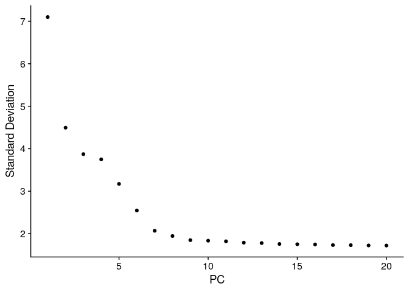<!-- -->

### Conclusio: To identify the true dimensionality of a dataset is a challenge. Therefore, several approaches should always be included.

1.  Supervised (exploring PCs to determine sources for heterogeneity),
    e.g. in combination with GSEA
2.  Statistical test based on the random null model (time consuming for
    large datasets, no clear PC cutoff)
3.  Heuristic (calculated instantly)

In this case a heuristic approach is used. The dicission is made by
looking at the plots. This is subjective as different persons could come
to different results and has a negative effect on reproducibility.

We choose 10 PCS for the cutoff, but the following still needs to be
considered: Dendritic cell and NK aficionados may recognize that genes
strongly associated with PCs 12 and 13 define rare immune subsets
(i.e. MZB1 is a marker for plasmacytoid DCs). However, these groups are
so rare, they are difficult to distinguish from background noise for a
dataset of this size without prior knowledge. \> repeat downstream
analyzes with a different number of PCs (10, 15, or even 50\!)

## Cluster the cells

Seutrat uses a graph-based clustering approach. The distance metric
remains the same and is based on the previously identified PCs. The
approach is based on manuscripts applied to graph-based clustering
approaches with scRNA seq data and is characterized by a graph
structure, e.g. KNN nearest neighbors. (edges drawn between cells with
similar feature expression patterns) and then graph is partitioned into
highly interconnected communities.

First, a KNN graph is constructed based on the Euclidean distance (in
PCA space), edge weights are redefined between all two cells based on
the overlap in their neighborhood. This step is done using the
FindNeighbors() function with the first 10 PCs as input. To cluster the
cells, modularity optimization techniques such as the Louvain algorithm
or SLM are applied. Groups are iteratively clustered with the goal of
optimizing the standard modularity function. The FindClusters() function
is used therefore, this sets the granularity for downstream clustering
(higher values, more clusters).

Settings: 0.4 - 1.2 for single-cell datasets with about 3K cells. The
larger the dataset, the more likely is an optimal solution. With the
Idents() function the clusters can be found.

``` r
pbmc <- FindNeighbors(pbmc, dims = 1:10)
pbmc <- FindClusters(pbmc, resolution = 0.5)
```

    ## Modularity Optimizer version 1.3.0 by Ludo Waltman and Nees Jan van Eck
    ## 
    ## Number of nodes: 2638
    ## Number of edges: 95965
    ## 
    ## Running Louvain algorithm...
    ## Maximum modularity in 10 random starts: 0.8723
    ## Number of communities: 9
    ## Elapsed time: 0 seconds

``` r
# Look at cluster IDs of the first 5 cells
head(Idents(pbmc), 5)
```

    ## AAACATACAACCAC-1 AAACATTGAGCTAC-1 AAACATTGATCAGC-1 AAACCGTGCTTCCG-1 
    ##                2                3                2                1 
    ## AAACCGTGTATGCG-1 
    ##                6 
    ## Levels: 0 1 2 3 4 5 6 7 8

## Non-linear dimensional reduction(UMAP)

For this we use UMAC, tSNE is offered as an alternative option.

The goal of nonlinear dimensional reduction techniques is to learn
underlying manifold of the data and place similar cells together in
low-dimensional space. Cells in the previously determined clusters are
to be displayed co-localized in the plots. The same PCs are used as
input as for the cluster analysis.

``` r
pbmc <- RunUMAP(pbmc, dims = 1:10)
```

``` r
# note that you can set `label = TRUE` or use the LabelClusters function to help label
# individual clusters
DimPlot(pbmc, reduction = "umap")
```

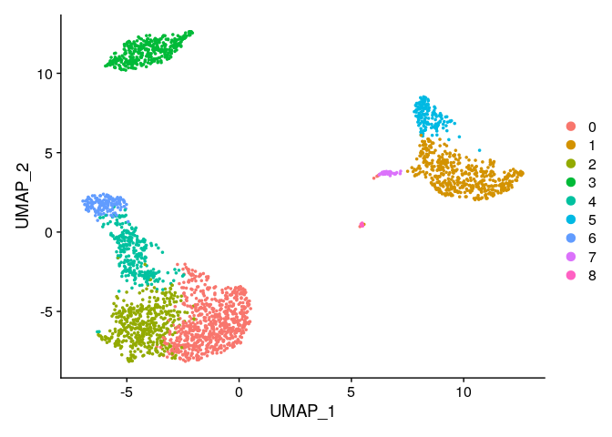<!-- -->

We save the Seurat Object. This can be used to do further analysis
without running the time consuming clustering again.

``` r
### output ordner angelegt
saveRDS(pbmc, file = "../output/pbmc_tutorial.rds")
```

## Search for differentially expressed traits (cluster biomarkers)

Now, markers are to be found which define clusters through differential
gene expression. By default, positive and negative markers of a single
cluster are identified compared to all other cells. Set threshold value:
A trait must be recognized to a minimum percentage in one of the two
cell groups and must be expressed differently between the two groups.
(both set to 0 leads to dramatic time savings). The maximum number of
cells can also be defined (increases the speed)

``` r
# find all markers of cluster 2
cluster2.markers <- FindMarkers(pbmc, ident.1 = 2, min.pct = 0.25)
head(cluster2.markers, n = 5)
```

    ##             p_val avg_log2FC pct.1 pct.2    p_val_adj
    ## IL32 2.593535e-91  1.2154360 0.949 0.466 3.556774e-87
    ## LTB  7.994465e-87  1.2828597 0.981 0.644 1.096361e-82
    ## CD3D 3.922451e-70  0.9359210 0.922 0.433 5.379250e-66
    ## IL7R 1.130870e-66  1.1776027 0.748 0.327 1.550876e-62
    ## LDHB 4.082189e-65  0.8837324 0.953 0.614 5.598314e-61

``` r
### find all markers distinguishing cluster 5 from clusters 0 and 3
cluster5.markers <- FindMarkers(pbmc, ident.1 = 5, ident.2 = c(0, 3), min.pct = 0.25)
head(cluster5.markers, n = 5)
```

    ##                       p_val avg_log2FC pct.1 pct.2     p_val_adj
    ## FCGR3A        2.150929e-209   4.267579 0.975 0.039 2.949784e-205
    ## IFITM3        6.103366e-199   3.877105 0.975 0.048 8.370156e-195
    ## CFD           8.891428e-198   3.411039 0.938 0.037 1.219370e-193
    ## CD68          2.374425e-194   3.014535 0.926 0.035 3.256286e-190
    ## RP11-290F20.3 9.308287e-191   2.722684 0.840 0.016 1.276538e-186

``` r
# find markers for every cluster compared to all remaining cells, report only the positive
# ones
pbmc.markers <- FindAllMarkers(pbmc, only.pos = TRUE, min.pct = 0.25, logfc.threshold = 0.25)
pbmc.markers %>%
    group_by(cluster) %>%
    slice_max(n = 2, order_by = avg_log2FC)
```

    ## # A tibble: 18 × 7
    ## # Groups:   cluster [9]
    ##        p_val avg_log2FC pct.1 pct.2 p_val_adj cluster gene    
    ##        <dbl>      <dbl> <dbl> <dbl>     <dbl> <fct>   <chr>   
    ##  1 1.17e- 83       1.33 0.435 0.108 1.60e- 79 0       CCR7    
    ##  2 1.74e-109       1.07 0.897 0.593 2.39e-105 0       LDHB    
    ##  3 0               5.57 0.996 0.215 0         1       S100A9  
    ##  4 0               5.48 0.975 0.121 0         1       S100A8  
    ##  5 7.99e- 87       1.28 0.981 0.644 1.10e- 82 2       LTB     
    ##  6 2.61e- 59       1.24 0.424 0.111 3.58e- 55 2       AQP3    
    ##  7 0               4.31 0.936 0.041 0         3       CD79A   
    ##  8 9.48e-271       3.59 0.622 0.022 1.30e-266 3       TCL1A   
    ##  9 4.93e-169       3.01 0.595 0.056 6.76e-165 4       GZMK    
    ## 10 1.17e-178       2.97 0.957 0.241 1.60e-174 4       CCL5    
    ## 11 3.51e-184       3.31 0.975 0.134 4.82e-180 5       FCGR3A  
    ## 12 2.03e-125       3.09 1     0.315 2.78e-121 5       LST1    
    ## 13 6.82e-175       4.92 0.958 0.135 9.36e-171 6       GNLY    
    ## 14 1.05e-265       4.89 0.986 0.071 1.44e-261 6       GZMB    
    ## 15 1.48e-220       3.87 0.812 0.011 2.03e-216 7       FCER1A  
    ## 16 1.67e- 21       2.87 1     0.513 2.28e- 17 7       HLA-DPB1
    ## 17 3.68e-110       8.58 1     0.024 5.05e-106 8       PPBP    
    ## 18 7.73e-200       7.24 1     0.01  1.06e-195 8       PF4

## Visualization of the marker expression

The violin plot shows the expression probability distribution over the
clusters. The feature plot visualizes the feature expression in a tSNE
or PCA plot. RidgePlot (), CellScatter () and DotPlot () can be further
options.

``` r
VlnPlot(pbmc, features = c("MS4A1", "CD79A"))
```

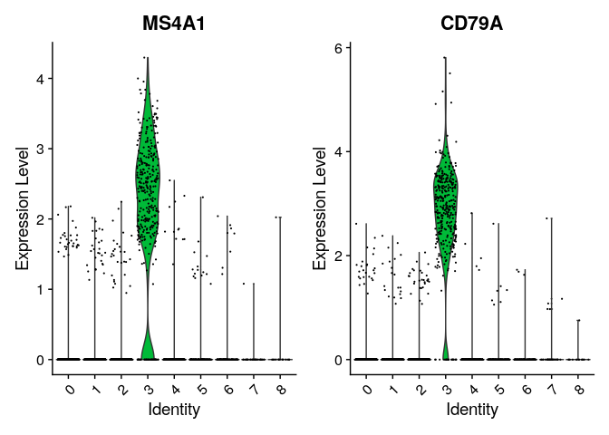<!-- -->

``` r
# you can plot raw counts as well
VlnPlot(pbmc, features = c("NKG7", "PF4"), slot = "counts", log = TRUE)
```

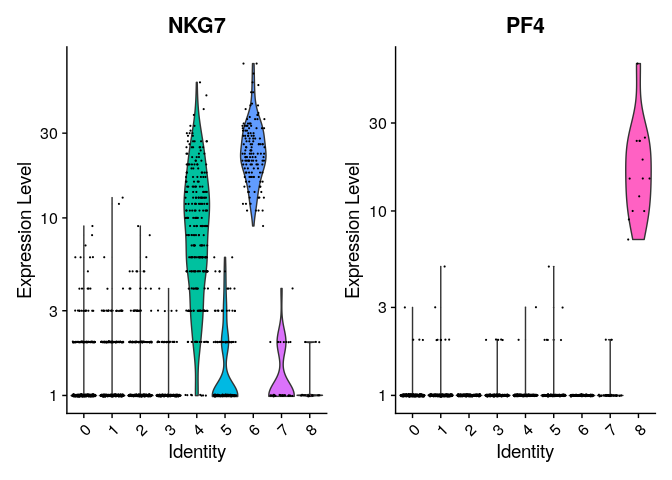<!-- -->

``` r
FeaturePlot(pbmc, features = c("MS4A1", "GNLY", "CD3E", "CD14", "FCER1A", "FCGR3A", "LYZ", "PPBP",
    "CD8A"))
```

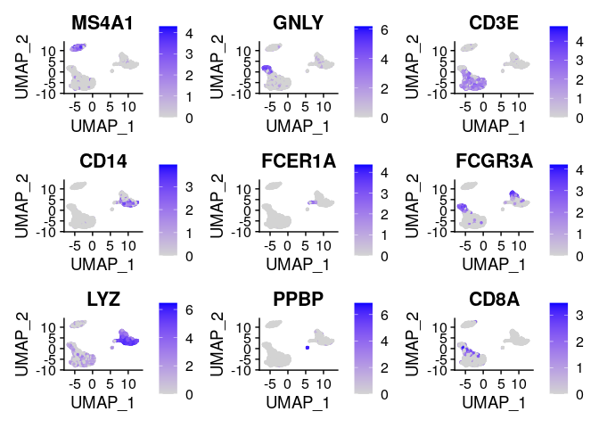<!-- -->

## DoHeatmap () can be used to generate an expression heatmap for cells and features. The top 20 markers for each cluster are plotted here.

``` r
pbmc.markers %>%
    group_by(cluster) %>%
    top_n(n = 10, wt = avg_log2FC) -> top10
DoHeatmap(pbmc, features = top10$gene) + NoLegend()
```

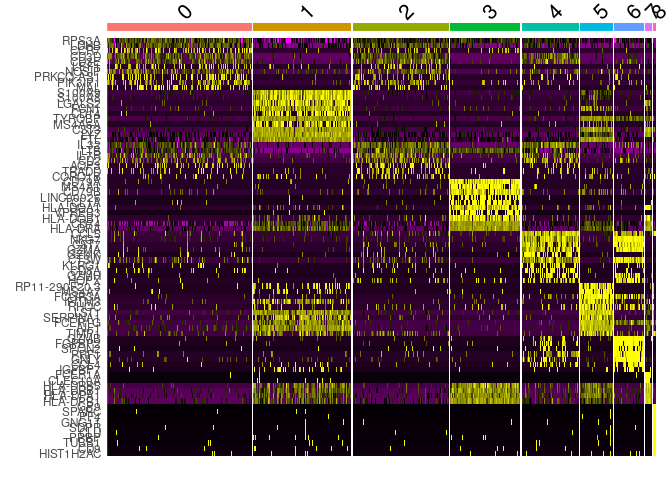<!-- -->

## Assigning cell type identity to clusters

As the last step in the workflow, canonical markers are sent to assign
the unbiased clustering to known cell types (9 assignments: “Naive CD4
T”, “CD14 + Mono”, “Memory CD4 T”, “B”, “CD8 T”, " FCGR3A + Mono
“,”NK“,”DC“,”Platelet"). The new clusters are visualized as umap
with DimPlot ().

``` r
new.cluster.ids <- c("Naive CD4 T", "CD14+ Mono", "Memory CD4 T", "B", "CD8 T", "FCGR3A+ Mono",
    "NK", "DC", "Platelet")
names(new.cluster.ids) <- levels(pbmc)
pbmc <- RenameIdents(pbmc, new.cluster.ids)
DimPlot(pbmc, reduction = "umap", label = TRUE, pt.size = 0.5) + NoLegend()
```

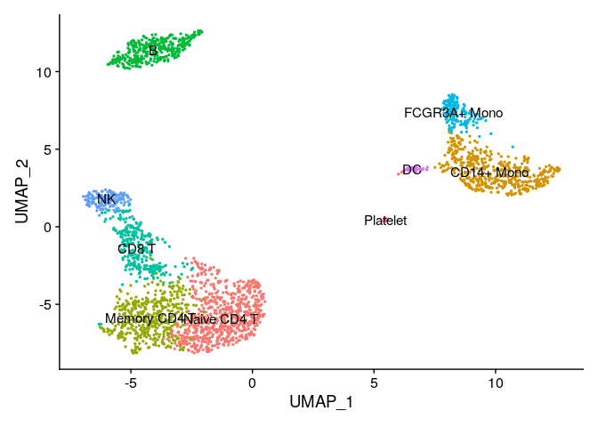<!-- -->

We save this final plot for later use.

Finally we save the final results as Seurat object.

``` r
saveRDS(pbmc, file = "../output/pbmc3k_final.rds")
```

<details>

<summary>**Session Info**</summary>

``` r
sessionInfo()
```

    ## R version 4.1.0 (2021-05-18)
    ## Platform: x86_64-conda-linux-gnu (64-bit)
    ## Running under: Fedora 34 (Workstation Edition)
    ## 
    ## Matrix products: default
    ## BLAS/LAPACK: /home/gschloegel/miniconda3/envs/seurat2/lib/libopenblasp-r0.3.18.so
    ## 
    ## locale:
    ##  [1] LC_CTYPE=en_US.UTF-8       LC_NUMERIC=C              
    ##  [3] LC_TIME=en_US.UTF-8        LC_COLLATE=en_US.UTF-8    
    ##  [5] LC_MONETARY=en_US.UTF-8    LC_MESSAGES=en_US.UTF-8   
    ##  [7] LC_PAPER=en_US.UTF-8       LC_NAME=C                 
    ##  [9] LC_ADDRESS=C               LC_TELEPHONE=C            
    ## [11] LC_MEASUREMENT=en_US.UTF-8 LC_IDENTIFICATION=C       
    ## 
    ## attached base packages:
    ## [1] stats     graphics  grDevices utils     datasets  methods   base     
    ## 
    ## other attached packages:
    ## [1] ggplot2_3.3.5      patchwork_1.1.1    SeuratObject_4.0.2 Seurat_4.0.4      
    ## [5] dplyr_1.0.7       
    ## 
    ## loaded via a namespace (and not attached):
    ##   [1] nlme_3.1-153          spatstat.sparse_2.0-0 matrixStats_0.61.0   
    ##   [4] RcppAnnoy_0.0.19      RColorBrewer_1.1-2    httr_1.4.2           
    ##   [7] sctransform_0.3.2     tools_4.1.0           utf8_1.2.2           
    ##  [10] R6_2.5.1              irlba_2.3.3           rpart_4.1-15         
    ##  [13] KernSmooth_2.23-20    uwot_0.1.10           mgcv_1.8-38          
    ##  [16] lazyeval_0.2.2        colorspace_2.0-2      withr_2.4.2          
    ##  [19] tidyselect_1.1.1      gridExtra_2.3         compiler_4.1.0       
    ##  [22] cli_3.1.0             plotly_4.10.0         labeling_0.4.2       
    ##  [25] scales_1.1.1          lmtest_0.9-39         spatstat.data_2.1-0  
    ##  [28] ggridges_0.5.3        pbapply_1.5-0         goftest_1.2-3        
    ##  [31] stringr_1.4.0         digest_0.6.28         spatstat.utils_2.2-0 
    ##  [34] rmarkdown_2.11        pkgconfig_2.0.3       htmltools_0.5.2      
    ##  [37] parallelly_1.29.0     highr_0.9             fastmap_1.1.0        
    ##  [40] htmlwidgets_1.5.4     rlang_0.4.12          rstudioapi_0.13      
    ##  [43] shiny_1.7.1           farver_2.1.0          generics_0.1.1       
    ##  [46] zoo_1.8-9             jsonlite_1.7.2        ica_1.0-2            
    ##  [49] magrittr_2.0.1        Matrix_1.3-4          Rcpp_1.0.7           
    ##  [52] munsell_0.5.0         fansi_0.4.2           abind_1.4-5          
    ##  [55] reticulate_1.22       lifecycle_1.0.1       stringi_1.7.5        
    ##  [58] yaml_2.2.1            MASS_7.3-54           Rtsne_0.15           
    ##  [61] plyr_1.8.6            grid_4.1.0            parallel_4.1.0       
    ##  [64] listenv_0.8.0         promises_1.2.0.1      ggrepel_0.9.1        
    ##  [67] crayon_1.4.2          deldir_1.0-6          miniUI_0.1.1.1       
    ##  [70] lattice_0.20-45       cowplot_1.1.1         splines_4.1.0        
    ##  [73] tensor_1.5            knitr_1.33            pillar_1.6.4         
    ##  [76] igraph_1.2.9          spatstat.geom_2.3-0   future.apply_1.8.1   
    ##  [79] reshape2_1.4.4        codetools_0.2-18      leiden_0.3.9         
    ##  [82] glue_1.5.0            evaluate_0.14         data.table_1.14.2    
    ##  [85] png_0.1-7             vctrs_0.3.8           httpuv_1.6.3         
    ##  [88] polyclip_1.10-0       gtable_0.3.0          RANN_2.6.1           
    ##  [91] purrr_0.3.4           spatstat.core_2.3-2   tidyr_1.1.4          
    ##  [94] scattermore_0.7       future_1.23.0         xfun_0.28            
    ##  [97] mime_0.12             xtable_1.8-4          RSpectra_0.16-0      
    ## [100] later_1.2.0           survival_3.2-13       viridisLite_0.4.0    
    ## [103] tibble_3.1.6          cluster_2.1.2         globals_0.14.0       
    ## [106] fitdistrplus_1.1-6    ellipsis_0.3.2        ROCR_1.0-11

</details>
